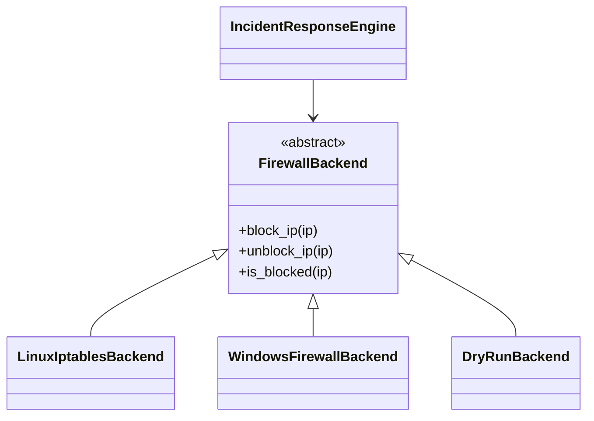

# Manuale tecnico

## Architettura

## Flusso operativo

1. `SSHLogParser` legge il file e normalizza le righe in `LoginFailure`.
2. `IncidentResponseEngine` aggrega gli eventi per IP e verifica soglia/finestra.
3. Il motore chiama `FirewallBackend.block_ip()` senza conoscere la sottoclasse concreta.
4. `StateStore` registra lo storico dei ban in JSON.

## Moduli

- `parser.py`: regex e parsing log SSH.
- `engine.py`: detection e response.
- `firewall/`: gerarchia OOP e backend concreti.
- `config.py`: configurazione JSON e whitelist.
- `state.py`: persistenza dei ban.
